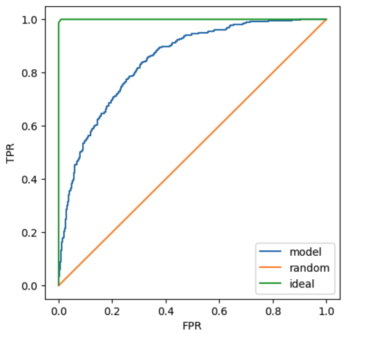
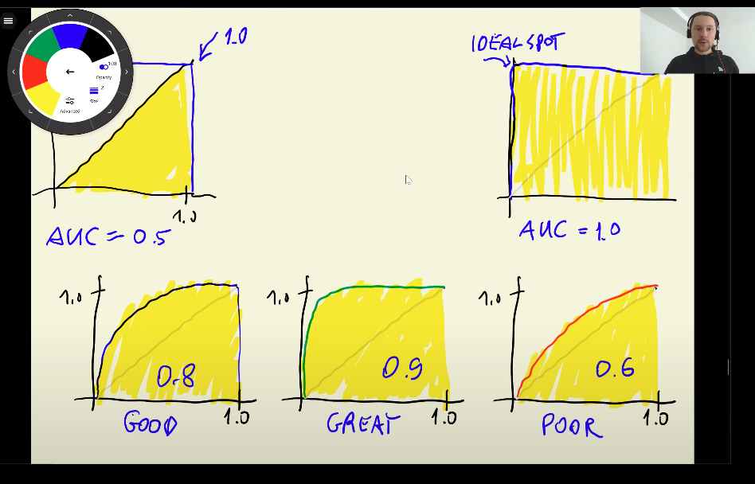

# Evaluation

## Accuracy
**Accuracy** measures the fraction of correct predictions. Specifically, it is the number of correct predictions divided by the total number of predictions.  
In Churn Project, 0.5 is the churn decision threshold and the accuracy score of model is around 80% However, the accuracy score of the dummy model (churn decision threshold = 1.0) is around 73%.   
Thus, we can see that the improvement of the original model with respect to the dummy model is not as high as we would expect. In other words, accruracy score cannot determine the performance of model.
The root cuase of this situation is **class imbalance**. It means the instance numbers in each category of target variables are unbalanced.

Classes and methods:
- `np.linspace(x,y,z)` -> returns a numpy array starting at x until y with z evenly spaced samples
- `Counter(x)` -> collection class that counts the number of instances that satisfy the x condition
- `accuracy_score(x, y)` -> sklearn.metrics class for calculating the accuracy of a model, given a predicted x dataset and a target y dataset.

## Confusion Table
**Cofusion table** is composed of True Positive, True Negative, False Negative and False Positive. Those four metrics are calculated on predicted values and target values.  
- Predict the customer will **churn** -> **Positive Class**
  - The customer does **churn** -> **True Positive**
  - The customer does **not churn** -> **False Positive**
- Predict the customer will **not churn** -> **Negative Class**
  - The customer does **churn** -> **False Negative**
  - The customer does **not churn** -> **True Negative**

<table>
  <tr>
    <th></th>
    <th></th>
    <th colspan="2" style="text-align: center;">Predictions</th>
  </tr>
  <tr>
    <td></td>
    <td></td>
    <td>Negative</td>
    <td>Positive</td>
  </tr>
  <tr>
    <td rowspan="2">Actual</td>
    <td>Negative</td>
    <td style="text-align: center;">TN</td>
    <td style="text-align: center;">FP</td>
  </tr>
  <tr>
    <td>Positive</td>
    <td style="text-align: center;">FN</td>
    <td style="text-align: center;">TP</td>
  </tr>
</table>
  
***Use predicted value to determine Postive or Negative, and compare predicted value and target value to determine True or False.***

The accuracy corresponds to the sum of TN and TP divided by the total of observations.

## Precision and Recall
### Precision
**Precision** tell us the fraction of positive predictions that are correct. It takes into account only the positive class (TP and FP - second column of the confusion matrix), as is stated in the following formula:
$$Precision = \cfrac{TP}{TP + FP}$$
***以 Predicted value = Positive为底***
### Recall
**Recall** measures the fraction of correctly identified postive instances. It considers parts of the positive and negative classes (TP and FN - second row of confusion table). The formula of this metric is presented below:
$$Recall = \cfrac{TP}{TP + FN}$$
***以 Actual value = Positive为底***
### Accuracy
$$Accuracy =\cfrac{TP + TN}{TP + TN + FP + FN}$$

## ROC Curves
ROC Curves measure the relationship between ***False Positive Rate (FPR)*** and ***True Postive Rate (TPR)***, which are derived from the values of the confusion matrix.  

**FPR** is the fraction of false positives (FP) divided by the total number of negatives (FP and TN - the first row of confusion matrix), and we want to minimize it. The formula of FPR is the following:
$$FPR = \cfrac{FP}{(TN + FP)}$$
***以 Actual value =  Negative为底, 数值越小越好***  

***TPR*** or ***Recall*** is the fraction of true positives (TP) divided by the total number of positives (FN and TP - second row of confusion table), and we want to maximize this metric. The formula of this measure is presented below:
$$TPR = \cfrac{TP}{(FN + TP)}$$
***以 Actual value = Positive为底, 数值越大越好***

***Model的curve越靠近ideal的curve越好, 越远离random的curve越好***

当threshold足够准确
- False Positive and False Negative = 0  
- True Positive Rate = 1, False Positive Rate = 0  

当threshold值越小，越多的y判定为Positive
- True Positive and False Positive数量也越来越大.  
  
当threshold值越大，越多的y判定为Negative
- True Negative and False Negative数量也会越老越大.  

当threshold = 0, 所有的y判定为Positive (1)  
- True Positive and False Positive达到最大值
- True Negative = False Negative = 0
- True Positive Rate = 1, False Positive Rate = 1

当threshold = 1, 所有的y判定为Negative (0)  
- True Negative and False Negative达到最大值
- True Positive = False Positive = 0  
- True Positive Rate = 0, False Positive Rate = 0

Classes and methods:
- `np.repeat([x,y], [z,w])` -> returns a numpy array with a z number of x values first, and then a w number of y values.
- `roc_curve(y_actual, y_pred)` -> sklearn.metrics class for calculating the false positive rates, true positive rates, and thresholds, given a target x dataset and a predicted y dataset.

## ROC AUC
***AUC*** measures area under ROC Curve, which could tell us the performance of model. In other words, AUC can be interpreted as a probability that a randomly selected positive example has a higher score than negative one. It's a popular metric for evaluating binary classification model.  
The AUROC of a bad model is 0.5, and an ideal one is 1.  
  

Classes and methods:
- `auc(x, y)` -> sklearn.metrics class for calculating area under the curve of the x and y datasets. For ROC curves x would be false positive rate, and y true positive rate.
- `roc_auc_score(y_actual, y_pred)` -> sklearn.metrics class for calculating area under the ROC curves on actual y and predicted y.
- `randint(x, y, size=z)` -> np.random class for generating random integers from the “discrete uniform” distribution; from x (inclusive) to y (exclusive) of size z.

## K-Fold Cross Validation
***Cross-validations*** refers to splitting full training dataset into k folds/partitions (k-1 folds for training and 1 fold for validation), training models k times and evaluating those k models using metrics (e.g. ROC AUC for binary classification).  
Also, we can use ***Cross-validations*** to find the best regularization $C$.

Libraries, classes and methods:
- `KFold(k, s, x)` -> sklearn.model_selection class for calculating the cross validation with k folds, s boolean attribute for shuffle decision, and an x random state
- `kfold.split(x)` -> sklearn.Kfold method for splitting the x dataset with the attributes established in the Kfold's object construction.
- `for i in tqdm()` -> library for showing the progress of each i iteration in a for loop.