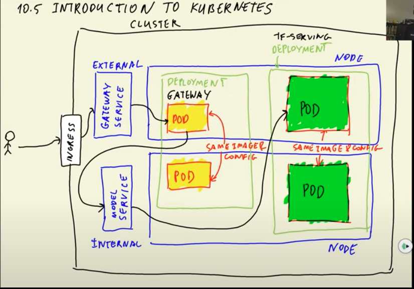

# Kubernetes
## Overview
这一章节主要讲两部分内容
- Gateway: API接口
- TF Serving：为模型部署提供环境，类似AWS Lambda。高性能，自动化管理，支持REST API
## Prepare Model
***Tensorflow Version: 2.12.0***

### Download Model
```bash
wget https://github.com/DataTalksClub/machine-learning-zoomcamp/releases/download/chapter7-model/xception_v4_large_08_0.894.h5 -O clothing-model.h5
```

### Convert Model - `HDF5` to `SavedModel`
```python
import tensorflow as tf
from tensorflow import keras
# tensorflow==2.12.0
model = keras.models.load_model('./clothing-model.h5')
# Save model in a folder
tf.saved_model.save(model, 'clothing-model')
```
### Pull Model Config Info
```bash
# List functions, methods, parameters in model
saved_model_cli show --dir clothing-model --all
```

## TF Serving
### Create TF Serving  Service on Docker
```bash
docker run -it --rm \ #Create an container
  -p 8500:8500 \ #Assign port
  -v $(pwd)/clothing-model:/models/clothing-model/1 \ #Volume Mounting: local:container
  -e MODEL_NAME="clothing-model" \ #Pass env variable
  tensorflow/serving:2.7.0 #Specify image
```

### Steps to Connet TF Serving
```
配置环境 -> 调取Docker Image -> 创建Container -> Mount Model to Docker -> 生成TF Serving Port -> 连接TF Serving频道 -> 处理图像数据 -> 连接TF Serving以及模型 -> 发送数据到port -> 提取预测结果
```

### Practice - Python Script
[tf-serving-connect.ipynb](tf-serving-connect.ipynb)

## Flask
### TF Serving with Flask
用Flask将TF Serving上传至port
[gateway.py](./gateway.py)

### Test Connection
在gatway运行之后，发送POST request到port
[connection-test.py](./test.py)
***在运行connection-test之前，需先启动gateway***

## Docker
### TF Serving: Custom Image and Container
[image-model.dockerfile](./image-model.dockerfile)

Image Bash Command
```bash
docker build -t clothing-model-tf-serving:xception-v4-001 -f image-model.dockerfile .
```
`-f`: specify Dockerfile name if it's not a default name.

Container Bash Command
```bash
docker run -it --rm \
-p 8500:8500 \
clothing-model-tf-serving:xception-v4-001
```

### Gateway: Custom Image and Container
[image-gateway.dockerfile](./image-gateway.dockerfile)

Image Bash Command
```bash
docker build -t clothing-model-gateway -f image-gateway.dockerfile .
```

Container Bash Command
```bash
docker run -it --rm \
-p 9696:9696 \
clothing-model-gateway:001
```

### Docker Compose
[docker-compose.yaml](./docker-compose.yaml)

```yaml
TF_SERVING_HOST=tf-serving:8500
```
在gateway service下面设置的environment variable配置了IP Address和Port
- IP Address: 用Container Name `tf-serving`代指，Docker会自动分辨其IP Address
- Port: 8500

## Kubernetes - Local Cluster
Kubernetes(又称K8)，是一个与docker有强关联性的container管理平台。拥有自动管理，自动修复，自动扩容等功能.  
- Pod：单个或多个任务, 由image生成的containers
- Node：包含、承载、运行所有Pod的机器（虚拟机或者物理机）
- Deployment：Manage a group of pods with the same image and config
- Service: Entrypoint of pods. Route requets to available pods. There are two types of services - internal service(default) and external service. Only external service can be visible to outside requests or services. 
- Ingress: Entrypoint of cluster. Route requests to external services.
- HPA: Horizontal pod autoscaler
```
Ingress -> External Service -> Node -> Available Pod in Deployment -> Internal Service -> Node -> Available Node in Deployment
```

### Setup K8s
Docker自带`K8s`和`kubectl`, 所以不需要另外下载. 但是Kind需要手动下载, `Kind`是辅助`K8 Cluster`在本地`Docker Container`环境运行的工具.
```bash
# 安装Kind
brew install kind
# 创建K8 Cluster
kind create cluster
# 删除K8 Cluster
kind delete cluster
```

### Deployment
Ping: [deployment.yaml](./ping/deployment.yaml)  
Clothing Model: [model-deployment.yaml](./kube-config/model-deployment.yaml)
Gateway: [gateway-deployment.yaml](./kube-config/gateway-deployment.yaml)

```bash
# 创建deployment
kubectl apply -f deployment.yaml
# 删除deployment
kubectl delete -f model-deployment.yaml
# 查看deployments
kubectl get deployment
# 查看pods
kubectl get pod
# 查看单一pod
kubectl describe pod <pod-name>
# 导入Image
kind load docker-image <image-name:tag>
# 映射Pod Port
kubectl port-forward <pod-name> <9696:9696>
# 登入Pod
kubectl exec -it <pod-name> -- bash
```

### Service
Ping: [service.yaml](./ping/service.yaml)  
Clothing Model: [model-service.yaml](./kube-config/model-service.yaml)
Gateway: [gateway-service.yaml](./kube-config/gateway-service.yaml)

```bash
# 创建service
kubectl apply -f service.yaml
# 查看service
kubectl get service
kubectl get svc
# 映射Port
kubectl port-forward service/<service-name> <8080:80>
```
- External Service: `type: ClusterIP`
- Internal Service: `type: LoadBalancer`
### Port Route
```
localhost port <--> service port <--> pod port
```

Pod port可以用来连接外部服务器，接发数据. 但是Pod Port的不稳定性导致他不适合运用到Prod Env中.

## AWS EKS
EKS stands for Elastic Kubernetes Service. 

### Download `eksctl`
```bash
brew tap weaveworks/tap
brew install weaveworks/tap/eksctl
```

### Create EKS Cluster
- Create a `yaml` file: [eks-config.yaml](./kube-config/eks-config.yaml)
- Execute `yaml` file in bash command: `eksctl create cluster -f eks-config.yaml`

### Create ECR
前面一个章节已经下载过了，下载过程可以翻看`READEME.md`
```bash
# 创建repo
aws ecr create-repository --repository-name mlzoomcamp-images
# 配置URI
ACCOUNT=209479306945
REGION=us-east-2
REGISTRY=mlzoomcamp-images
PREFIX=${ACCOUNT}.dkr.ecr.${REGION}.amazonaws.com/${REGISTRY}
# Gateway URI
GATEWAY_LOCAL=clothing-model-gateway:002
GATEWAY_REMOTE=${PREFIX}:clothing-model-gateway-002
# 标记本地和远程的Gateway Image
docker tag ${GATEWAY_LOCAL} ${GATEWAY_REMOTE}
# Model URI
MODEL_LOCAL=clothing-model-tf-serving:xception-v4-001
MODEL_REMOTE=${PREFIX}:clothing-model-tf-serving-xception-v4-001
# 标记本地和远程的Model Image
docker tag ${MODEL_LOCAL} ${MODEL_REMOTE}
```

### Login ECR
```bash
$(aws ecr get-login --no-include-email)
```

### Push Images to ECR
```bash
docker push ${GATEWAY_REMOTE}
docker push ${MODEL_REMOTE}
```

### Create Deployment and Service on EKS
```bash
kubectl apply -f model-deployment.yaml
kubectl apply -f model-service.yaml
kubectl apply -f gateway-deployment.yaml
kubectl apply -f gateway-service.yaml
```
用`gateway.py`测试连接
```bash
kubectl port-forward service/tf-serving-clothing-model 8500:8500
python gateway.py
kubectl port-forward service/gateway-clothing-model 8080:80
python test.py
```
### Test Connection to Gateway Service
用`kubectl get svc`可以查看Gateway Service对应的External IP Address.
```python
# New URL: External IP Address + Endpoint
url = url = 'http://a4a853d8db21b47f892015f964cc4ab5-1561477282.us-east-2.elb.amazonaws.com/predict'
```
### Delete EKS Cluster
```bash
eksctl delete cluster --name mlzoomcamp-eks
```