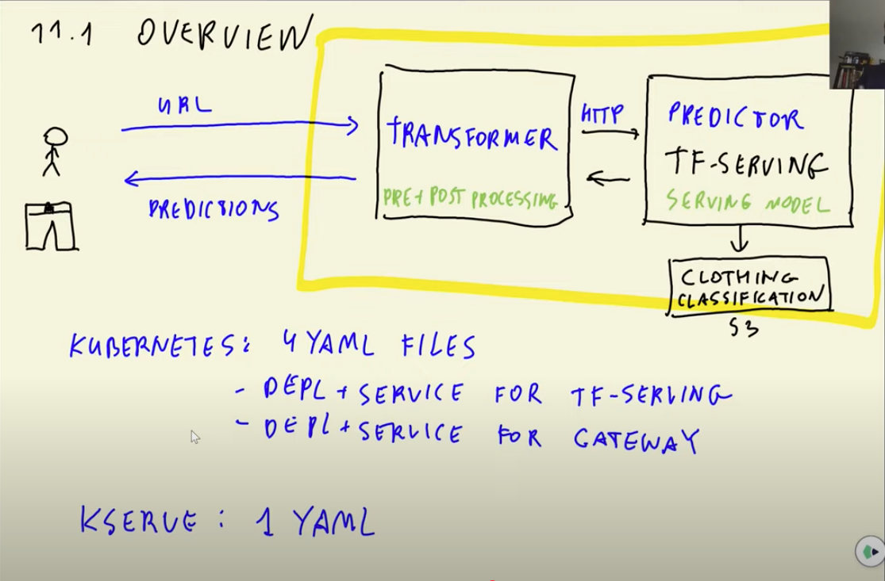

# KServe
## K8s vs KServe
- K8s一共需要四个`YAML File`配置`gateway`和`tf serving`
  - Deployment and service for gateway
  - Deployment and service for tf serving
- KServe只需要一个`YAML File`
- KServer可以支持多种模型, 比如`tensorflow`, `XGB`, `sklearn`, etc


## Install KServe and Launch InferenceService
### Install KServe
```bash
# 下载Kserve(v.0.7)
wget https://raw.githubusercontent.com/kserve/kserve/release-0.8/hack/quick_install.sh
# 前置要求
brew install helm
kind create cluster #创建kube环境
kubectl config get-contexts #列出所有kube环境
kubectl config use-context kind-kind #切换kube环境
# 安装Kserve
bash quick_install.sh
# 或者
chmod+x quick_install.sh
./quick_install.sh
# 检查kserve状态
kubectl get pod -n kserve
```

### Setup InferenceService
#### InferenceService优点
InferenceService自动化配置Model Docker Image, Deployment and Service YAML file, API Connection, and monitor. 用户不需要再手动配置这些服务，只需要训练好模型.
#### Step1: Create A Namespace
```bash
kubectl create namespace kserve-test
```
#### Step2: Create InferenceService YAML File
```yaml
kubectl apply -n kserve-test -f - <<EOF
apiVersion: "serving.kserve.io/v1beta1"
kind: "InferenceService" #resource
metadata:
  name: "sklearn-iris" #service name
  namespace: kserve-test #folder
spec:
  predictor: #model name
    model:
      modelFormat:
        name: sklearn #model type
      storageUri: "gs://kfserving-examples/models/sklearn/1.0/model" #location to model
EOF
```
#### Step3: Check InferenceService Status
```bash
kubectl get inferenceservices sklearn-iris -n kserve-test
# The command above return URL: http://sklearn-iris.kserve-test.example.com 
# Port: 80
```
#### Step4: Port Forwarding
```bash
kubectl port-forward -n istio-system service/istio-ingressgateway 8080:80
#-n: namespace
```

#### Step5: Test InferenceService
```bash
SERVICE_NAME=sklearn-iris
HOST=${SERVICE_NAME}.kserve-test.example.com
URL=http://localhost:8080/v1/models/${SERVICE_NAME}:predict

curl -H "Host: ${HOST}" \
-H "Content-Type: application/json" \
${URL} \
-d @iris-request.json
```

## Deploy Scikit-Learn Model with KServe
### Pre-requisite
Create a virtual environment matched KServe's requirement. (reference to kserve github)
- Python == 3.9 ~ 3.11
- Scikit-Learn == 1.5.2
```bash
conda create -n py311-sklearn152 python=3.11 scikit-learn=1.5.2 pandas joblib
conda activate py311-sklearn152
```
### Prepare Classification Model
[Churn Classification Python Script](./churn-classification/churn-train.py)
```python
# Add DictVectorizer and LogisticsRegression to pipeline
from sklearn.pipeline import Pipeline

pipeline = Pipeline([
    ('vectorizer', DictVectorizer(sparse=False)),
    ('model', LogisticRegression(C=1.0, solver='liblinear'))
])
# dict is X_train and df.churn.values is y_train
pipeline.fit(dicts, df.churn.values)
```

### Connect to Model via HTTP Server
#### Upload Model to HTTP Server
```bash
python -m http.server
```
#### LocalHost IP Address
```
ifconfig -a
```
### InferenceService & Model
#### YAML
[Churn Service YAML](./churn-classification/churn-service.yaml)
```bash
kubectl apply -f churn-service.yaml
```

#### Check Pod Status
```bash
kubectl get pods -n churn-classification
```

#### Execute Pod
```bash
kubectl exec -it churn-predictor-00001-deployment-7bc6778c4-b8w4l kserve-container -- bash
# model stored in 'mnt/models/'
```

#### Test Connection
[Churn Test Python Script](./churn-classification/churn-test.py)
```bash
kubectl port-forward -n istio-system service/istio-ingressgateway 8080:80
python churn-test.py
```

## Deploy Custom Scikit-Learn Images with KServe (v 0.7)
### Customize Sklearn in Kserve
- [sklearn.Dockerfile](./kserve/kserve-release-0.7/python/sklearn.Dockerfile)
- [setup.py](./kserve/kserve-release-0.7/python/sklearnserver/setup.py)

### Build Custom Docker Image
```bash
docker build -t kserve-sklearnserver:3.8-1.0 -f sklearn.Dockerfile .
docker build -t kserve-sklearnserver:preict_proba-3.8-1.0 -f sklearn.Dockerfile .
```

### Config Virtual Env & Export Model
```bash
pyenv install 3.8.10 #配置所需的python环境
pipenv --python 3.8.10 install scikit-lean==1.0 joblib pandas #在python3.8.10的基础上，安装其余packages
pipenv run python churn-train.py # export model.joblib
```

### Config SklearnServer 
[SklearServer Setup](./kserve/kserve-release-0.7/python/sklearnserver/setup.py)
```python
install_requires=[
    "kserve==0.7.0", 
    "scikit-learn == 1.0",
    "joblib >= 0.13.0",
    "protobuf<3.21", # New
    "ray<=2.4",  # New
    "numpy==1.23.5"  # New
],
```

### Mount Model to Docker
```bash
cd ../../../churn-classification 
docker run -it --rm \
-v "$(pwd)/model.joblib:/mnt/models/model.joblib" \
-p 8081:8080 \
kserve-sklearnserver:3.8-1.0 \
--model_dir=/mnt/models \
--model_name=churn

docker run -it --rm \
-v "$(pwd)/model.joblib:/mnt/models/model.joblib" \
-p 8081:8080 \
kserve-sklearnserver:preict_proba-3.8-1.0 \
--model_dir=/mnt/models \
--model_name=churn
```